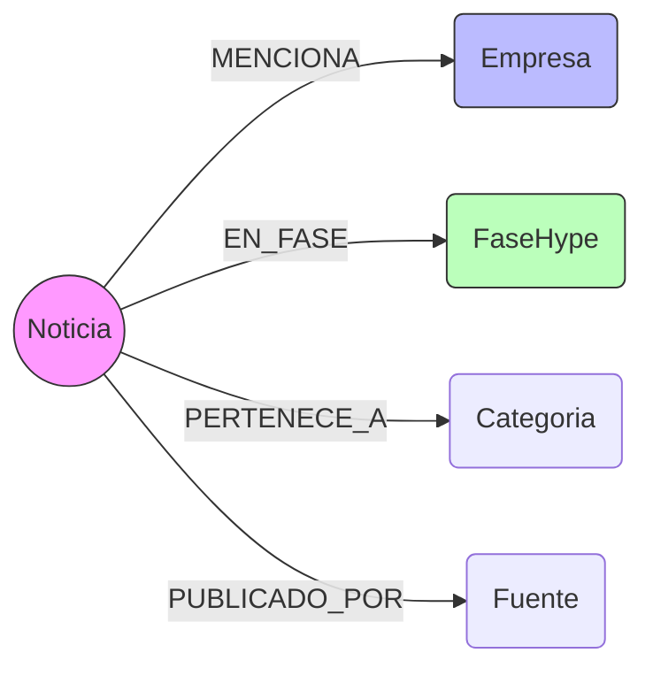

# Esquema de Datos en Neo4j (Graph Schema)

Este documento detalla la estructura exacta de la base de datos, dónde se guardan los metadatos de IA y cómo se relacionan los nodos.

## 1. Dónde se guardan los "Outputs Inteligentes" del LLM
Todos los metadatos generados por Llama 3 se almacenan como **propiedades** dentro del nodo **`Noticia`**.

*   **Nodo:** `(n:Noticia)`
*   **Propiedades (Campos):**
    *   `n.sentimiento`: (Float) Valor entre -1.0 y 1.0.
    *   `n.subjetividad`: (Float) Valor entre 0.0 y 1.0.
    *   `n.razonamiento`: (String) El texto explicativo generado por la IA.
    *   `n.relevancia`: (Float) Puntuación de relevancia.
    *   `n.embedding`: (Vector) Lista de 384 números (para búsqueda semántica).

**Ejemplo de consulta Cypher para ver estos datos:**
```cypher
MATCH (n:Noticia)
RETURN n.titulo, n.sentimiento, n.subjetividad, n.razonamiento
LIMIT 5
```

## 2. Tipos de Relaciones (Edges)
Estas son todas las relaciones (flechas) que existen actualmente en el grafo:

1.  **`[:MENCIONA]`**
    *   **Origen:** `(Noticia)` ➔ **Destino:** `(Empresa)`
    *   *Significado:* La noticia habla sobre esta empresa o tecnología.
    
2.  **`[:EN_FASE]`**
    *   **Origen:** `(Noticia)` ➔ **Destino:** `(FaseHype)`
    *   *Significado:* La noticia clasifica el evento en esta fase del ciclo de Gartner (ej. "Pico de Expectativas").

3.  **`[:PERTENECE_A]`**
    *   **Origen:** `(Noticia)` ➔ **Destino:** `(Categoria)`
    *   *Significado:* Clasificación temática (ej. "Ransomware", "Defensa").

4.  **`[:PUBLICADO_POR]`**
    *   **Origen:** `(Noticia)` ➔ **Destino:** `(Fuente)`
    *   *Significado:* Medio de comunicación que publicó la noticia (ej. "TechCrunch").

## Resumen Visual del Modelo

